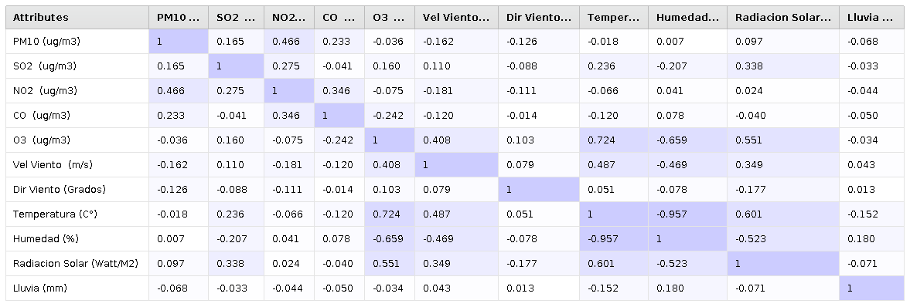
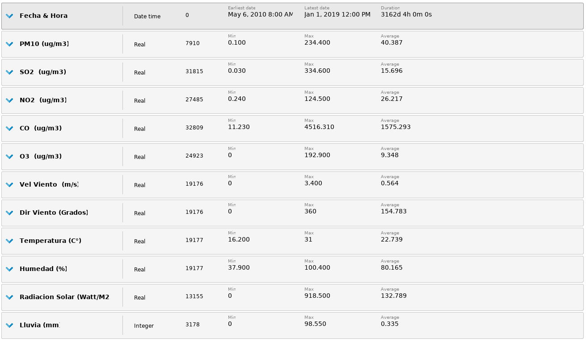
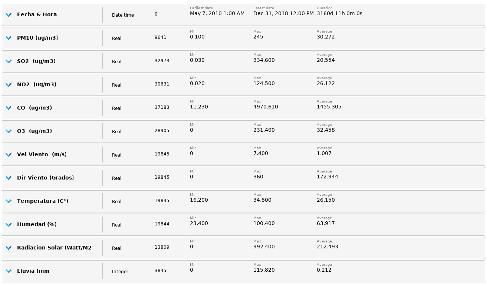

```{r setup, include=FALSE}
knitr::opts_chunk$set(echo = TRUE)
#install.packages("psych")
#install.packages("dplyr")
```

# Introducción

La **calidad del aire**, se define como la cantidad general de polución presente en 
un area y como la pureza promedio atmosférica en relación a las medidas de 
descarga tomadas de una fuente de polución [@DEFAIRQ2007]. La contaminación del 
aire, representa un importante riesgo medioambiental para la salud, bien sea en 
los países desarrollados o en los países en desarrollo ya que es evidenciado en 
casos en morbilidad por trastornos cerebrovasculares, cánceres de pulmón y neumopatías 
crónicas y agudas. Por lo tanto, cuanto más bajos sean los niveles de contaminación del aire, 
mejor será la salud cardiovascular y respiratoria de la población a largo y a corto plazo [@OMS2016].

De los 23 países de América Latina y el Caribe, 18 tienen sus propias regulaciones 
vigentes en la actualidad relacionadas con la calidad del aire, que son de acceso 
público en los sitios web oficiales [@INSAIRQ2016]. La trazabilidad para tales regulaciones se 
establece para los contaminantes de criterio (PM10, PM2.5, SO2, NO2, O-3, CO), 
utilizando como referencia la secuencia histórica de estándares de la 
Agencia de Protección Ambiental de los Estados Unidos [@USEPA2019] y los valores de 
referencia de La Organización Mundial de la Salud [@OMS2019]. 

En Colombia, el Sistema de Vigilancia de la Calidad del Aire de Cali [@SVCAC2019], opera 
bajo la coordinación y administración del Departamento Administrativo de Gestión 
del Medio Ambiente [@DAGMA2019],Grupo de Calidad del Aire. El Sistema de Vigilancia de Calidad del Aire de
Santiago de Cali SVCASC fue acreditado en la norma NTC-ISO/IEC 17025 del año 2005 por el
IDEAM a través de la Resolución 1328 del 23 de junio de 2018. El SVCASC actualmente 
funciona con nueve (9) estaciones: La estación La Flora, ubicada en el barrio La Flora en la zona norte;
La estación ubicada en el barrio obrero y la estaciuón Ermita ubicada en el barrio San Pedro ambas en la zona centro; 
la estación transitoria EDB - Navarro ubicada en el barrio Poblado en la zona oriente; la estación base Aérea, ubicada en el acuaparque de la
Caña en zona nororiente; la estación Pance ubicadada en la Zona Rural; la estación Univalle ubicada en el
barrio Meléndez en la zona sur; la estación compartir ubicada en el Barrio Compartir en la zona oriente y la estación
Cañaveralejo ubicada en la estación SITM del MIO en la zona suroccidente.

El presente trabajo, realizará un análisis de la captura de datos de la estación _La Flora_, la cual 
es una estación automática que reporta información horaria al centro de control del DAGMA. 
Esta estación, mide los niveles de Material Particulado Menor a 10 micrómetros (PM10), Dióxido de Azufre (SO2), 
Dióxido de Nitrógeno (NO2), Monóxido de Carbono (CO), Ozono (O3) y variables meteorológicas 
como velocidad del viento, dirección del viento, temperatura, humedad, radiación solar y precipitación. El
proceso de preparación y análisis de los datos seguirá la siguiente estructura:

1. **_Carga y exploración_**: Se incluirá el archivo de datos y se identificarán las características del conjunto de datos
2. **_Limpieza de datos_**: A partir de la exploración, se definirán los procedimientos para la limpieza de datos para facilitar el análisis
3. **_Creación de la vista minable_**: Se establecerán los conjuntos de datos finales y su correspondiente análisis
4. **_Conclusiones e infografía_**: Se compilará el conocimiento adquirido y las cifras de interés adquiridas.

# 1. Carga y exploración

### Tablas de resumen
Para los procedimientos de carga y exploración, se emplearán las herramientas
RStudio y RapidMiner. Inicialmente, se realiza la carga de archivos con el
fin de resumir las características generales de los datos.

```{r , echo=T, eval= T}
datos_base_flora<-read.csv(file="data/dataCAFloraPrep.csv",
                 header = TRUE,sep = ",", dec = ".",fileEncoding = "latin1")
str(datos_base_flora,vec.len=0)
```

El conjunto de datos contiene un total 84.629 observaciones con 12 variables. La descripción
de las variables se relaciona a continuación:

| Variable                  | Tipo de variable  | Descripción                                                  |
|---------------------------|-------------------|--------------------------------------------------------------|
| Fecha & Hora              | Fecha             | Fecha y hora de la captura del senso de polutantes           |
| PM10 (ug/m3)              | Contínua          | Concentración de Material Particulado Menor a 10 micrómetros |
| SO2 (ug/m3)               | Contínua          | Concentración de Dióxido de Azufre                           |
| NO2  (ug/m3)              | Contínua          | Concentración de Dióxido de Nitrógeno                        |
| CO (ug/m3)                | Contínua          | Concentración de Monóxido de Carbono                         |
| O3 (ug/m3)                | Contínua          | Concentración de Ozono                                       |
| Vel Viento (m/s)          | Contínua          | Velocidad del viento en metros por segundo                   |
| Dir Viento (Grados)       | Contínua          | Dirección del viento                                         |
| Temperatura (C°)          | Contínua          | Temperatura en grados celsius                                |
| Humedad (%)               | Contínua          | Porcentaje de humedad                                        |
| Radiacion Solar           | Contínua          | Radiación Solar (Watt/M2)                                    |
| Lluvia (mm)               | Contínua          | Cantidad de precipitaciones                                  |

### Resumen de frecuencia de valores en las variables

Con el fin de identificar los posibles valores en las variables, la frecuencia de dichos valores de forma general y detectar valores ausentes
se realiza la siguiente exploración mediante la exposición y resumen. Con el fin de facilitar su visualización
se realiza una partición por cada 3 variables, utilizando la función summary del lenguaje R.

En las siguientes listas, se puede apreciar una cantidad significativa de registros con ausencia de valor numérico o valores en cero, con diferentes magnitudes de frecuencia entre las
diferentes variables. Según los boletines emitidos por la SVCASC, dichos datos faltantes pueden estar relacionados a las anomalías que se dan en las estaciones de monitoreo, tales como: Fallas en los equipos, falta de energía eléctrica en la zona, hurto de equipos o cableado, mantenimiento o cambio de equipos y la inclusión o exclusión de algunos contaminantes o variables meteorológicas. Por otra parte, se puede evidenciar que existe más de un registro con  misma fecha y hora, lo que puede sugerir un proceso de limpieza en el que se excluirían dichos registros duplicados. Este procedimiento, se verá con más detalle
en la sección 2.


```{r , echo=T, eval= T}
summary(datos_base_flora[1:3])
```

```{r , echo=T, eval= T}
summary(datos_base_flora[4:6])
```

```{r , echo=T, eval= T}
summary(datos_base_flora[7:9])
```

```{r , echo=T, eval= T}
summary(datos_base_flora[10:12])
```

### Métricas de tendencia central, forma y dispersión
Explicar librerira psych, dplyr y los valores que se están calculando
Explicar librerira psych, dplyr y los valores que se están calculando
Explicar librerira psych, dplyr y los valores que se están calculando
Explicar librerira psych, dplyr y los valores que se están calculando
Explicar librerira psych, dplyr y los valores que se están calculando
Archivo 1_visualización_exploración.rmp

```{r , echo=T, eval= T,message=F,warning=F}
library(psych)
library(dplyr)
estadisticas <- describe(datos_base_flora[,2:12],na.rm = TRUE, interp=FALSE,skew = TRUE, 
             ranges = TRUE,trim=.1,check=TRUE,fast=NULL,quant=c(.25,.50,.75),IQR=TRUE)
estadisticas <- estadisticas%>%mutate(Q0.75 + (1.5* IQR))
estadisticas <- estadisticas%>%mutate(Q0.25 - (1.5* IQR))
estadisticas
```

bla bla bla PM10

```{r , echo=FALSE, out.width = '50%', out.height='50%'}
knitr::include_graphics(c("images/hist_explor_PM10.png",
                          "images/bplot_explor_PM10.png"))
```

bla bla bla SO2

```{r , echo=FALSE, out.width = '50%', out.height='50%'}
knitr::include_graphics(c("images/hist_explor_SO2.png",
                          "images/bplot_explor_SO2.png"))
```

bla bla bla NO2

```{r , echo=FALSE, out.width = '50%', out.height='50%'}
knitr::include_graphics(c("images/hist_explor_NO2.png",
                          "images/bplot_explor_NO2.png"))
```

bla bla bla CO

```{r , echo=FALSE, out.width = '50%', out.height='50%'}
knitr::include_graphics(c("images/hist_explor_CO.png",
                          "images/bplot_explor_CO.png"))
```

bla bla bla O3

```{r , echo=FALSE, out.width = '50%', out.height='50%'}
knitr::include_graphics(c("images/hist_explor_O3.png",
                          "images/bplot_explor_O3.png"))
```

bla bla bla Velocidad del viento

```{r , echo=FALSE, out.width = '50%', out.height='50%'}
knitr::include_graphics(c("images/hist_explor_VViento.png",
                          "images/bplot_explor_VViento.png"))
```

bla bla bla Dirección del viento

```{r , echo=FALSE, out.width = '50%', out.height='50%'}
knitr::include_graphics(c("images/hist_explor_DViento.png",
                          "images/bplot_explor_DViento.png"))
```

bla bla bla Temperatura

```{r , echo=FALSE, out.width = '50%', out.height='50%'}
knitr::include_graphics(c("images/hist_explor_Temperatura.png",
                          "images/bplot_explor_Temperatura.png"
                          ))
```

bla bla bla Humedad

```{r , echo=FALSE, out.width = '50%', out.height='50%'}
knitr::include_graphics(c("images/hist_explor_Humedad.png",
                          "images/bplot_explor_Humedad.png"
                          ))
```

bla bla bla RSolar

```{r , echo=FALSE, out.width = '50%', out.height='50%'}
knitr::include_graphics(c("images/hist_explor_RSolar.png",
                          "images/bplot_explor_RSolar.png"
                          ))
```

bla bla bla Lluvia

```{r , echo=FALSE, out.width = '50%', out.height='50%'}
knitr::include_graphics(c("images/hist_explor_Lluvia.png",
                          "images/bplot_explor_Lluvia.png"
                          ))
```

### Análisis de Correlación


bla bla bla correlación 

```{r , echo=FALSE, out.width = '100%', out.height='50%'}

```

# 2. Limpieza de datos

Archivo 2_limpieza_datos.rmp

### Reconocimiento y tratamiento de atributos con valores únicos o distintos

El campo fecha y hora corresponde a un campo único, sin embargo
existen registros duplicados con dicho campo y se evidencian valores diferentes
entre los conjuntos resultantes

Conjunto A con 37937 observaciones

```{r , echo=FALSE, out.width = '100%', out.height='50%'}

```

Conjunto B con 46692 observaciones

```{r , echo=FALSE, out.width = '100%', out.height='50%'}

```

### Reconocimiento y tratamiento de atributos con valores faltantes

Como se pudo apreciar en la exploración 11 de las 12 variables
contienen valores faltantes. Se realizará la separación de variables por polutantes
dejando en los subconjuntos los valores de los factores ambientales. Posteriormente,
se relizará la remoción de los registros con valores faltantes. La razón de no 
realizar una imputación de los valores será para no viciar los procedimientos de limpieza
posteriores o los análisis y creación de la vista minable de la sección 3.


### Reconocimiento y tratamiento de atributos con valores atípicos
### Reconocimiento y tratamiento de registros atípicos
### Reconocimiento y tratamiento de atributos redundantes

# 3. Creación de la vista minable

### Generación de variables derivadas tipo 1 y 2
### Normalización de al menos un atributo
### Discretización de al menos un atributo
### Numerización 1 a n de al menos un atributo

# 4. Conclusiones e Infografía

# Referencias

